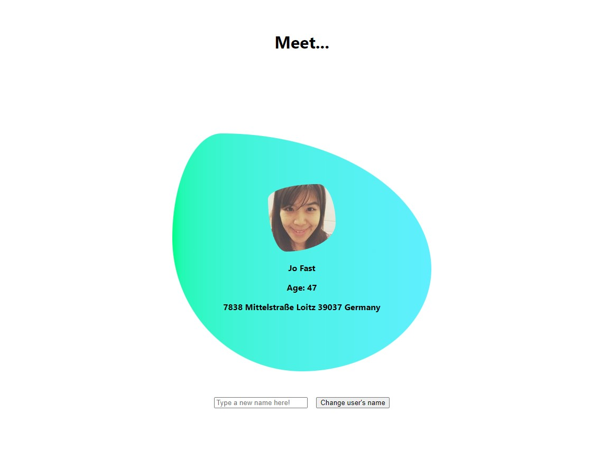

# User UI

This Project was built to develop my TypeScript, CSS and React skills further, whilst also using data from a third-party API.

## Description

As a training tool, I utilised useState, useEffect and prop-drilling to create this simple App. It pulls data from the [randomuser.me](https://randomuser.me/api/) api. It displays selected details for a "user" and allows you to change the name of the user (by updating the state).

## Tools

This project was bootstrapped with [Create React App](https://github.com/facebook/create-react-app).

## License

[MIT](https://choosealicense.com/licenses/mit/)
